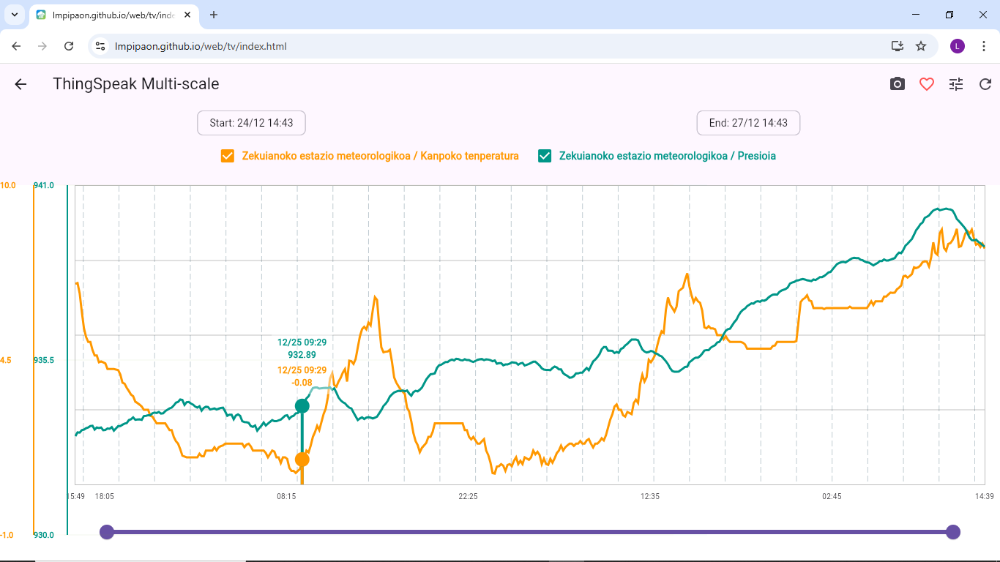
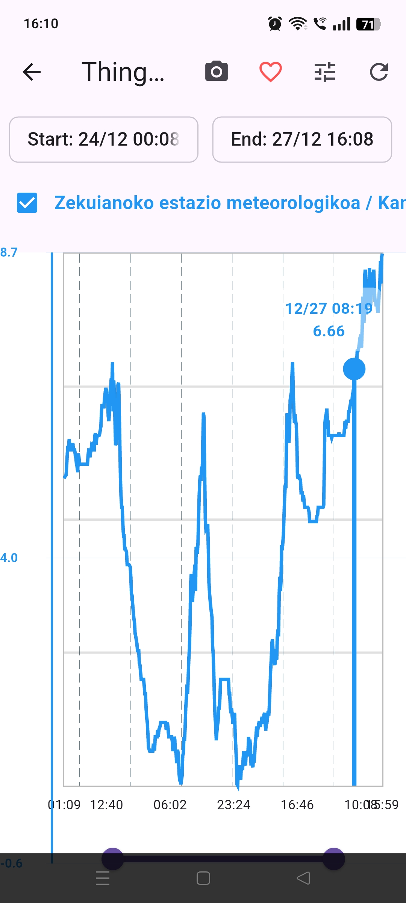

# ThingSpeak Graphics Viewer 📊


A simple and efficient tool built with **Flutter** to visualize your ThingSpeak IoT data. This app allows you to monitor your channels across multiple platforms including mobile, web, and desktop (Windows/Linux).

---

## 🚀 Why this app?

Most ThingSpeak viewers require you to manually add each Channel ID and its specific Read API Key one by one. This project simplifies that process significantly:

* **Centralized Access:** You only need to provide your **User API Key**.
* **Automatic Discovery:** The app automatically fetches and lists all channels linked to your account.
* **Multi-Platform Support:** One single codebase that runs seamlessly on Web, Android, iOS, Windows, and Linux.

---

## 📥 Download & Try it out

### 🌐 Web Version
You can try the web version instantly without installing anything:
👉 **[Open Web App Demo](https://lmpipaon.github.io/web/tv/index.html)**

### 💻 Desktop & Mobile Binaries
If you don't want to compile the code, you can download the ready-to-use executables (Windows, Linux, Android) from the **Releases** section:
👉 **[Download Latest Release](https://github.com/lmpipaon/ThingSpeak_visualizer/releases)**

---

## 📸 Screenshots

| Desktop View (Windows) |
| :---: |
|  |
| Movile View |
| :---: |
|  |

---

## 🔒 Security & Privacy
Privacy is handled with a "local-first" approach:
* **Local Storage:** Your User API Key is stored **locally** on your device or computer using secure storage.
* **Direct Communication:** The app communicates directly with the official ThingSpeak API. 
* **No Data Distribution:** Your credentials are never shared, never uploaded to external servers, and never distributed.

---

## ⚙️ Development & Installation

If you want to run the project from source or contribute, follow these steps:

### 1. Prerequisites
* [Flutter SDK](https://docs.flutter.dev/get-started/install) installed.
* **For Windows:** [Visual Studio 2022](https://visualstudio.microsoft.com/vs/community/) with "Desktop development with C++".
* **For Linux:** ```bash
    sudo apt-get install clang cmake ninja-build pkg-config libgtk-3-dev liblzma-dev
    ```

### 2. Setup
```bash
git clone [https://github.com/lmpipaon/ThingSpeak_visualizer.git](https://github.com/lmpipaon/ThingSpeak_visualizer.git)
cd ThingSpeak_visualizer
flutter pub get